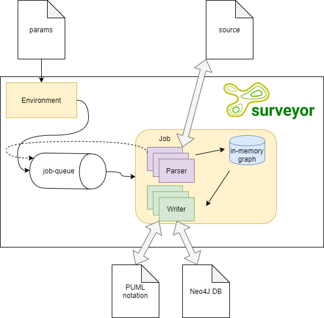

# Architecture

## Parsers

Parser classes are children of `AbstractParser`, they are capable of mining out some elements and connections from the code. So these components together can build the graph about the given project. They are located in the [parsers](../src/parsers) directory. They have to be registered into parsers.ts.

## Database

Database is a component here which is able to store the graph which was built by parsers. Currently it stores the data only in the memory (so actually it is not persistent). It is located in the [persistence](../src/persistence) directory.

## Writers

Writers are capable of serializing the content of the database in a specific format. They have to extend `AbstractWriter`, and have to be registered into writers.ts.

Implementations:
 - [puml-writer](../src/writers/puml-writer.ts) which creates a PUML notation format.
  - [neo4j-writer](../src/writers/neo4j-writer.ts) which writes to neo4j. 

## Job mechanism

Parameters of a parsing job (such as the working directory, parsers, writers to execute etc.) are represented by [JobContext](../src/job-context.ts). Based on these params [Jobs](../src/job.ts) are pushed into the job queue (also in the environment object). The main (only) thread pops these jobs out of the queue and executes them one by one.

The first job is pushed when the Environment object is created, so at the beginning of the execution. After that, parsers or writers may push new jobs by calling the Environment's `pushJob(jobParams: EnvironmentParams)` method.
